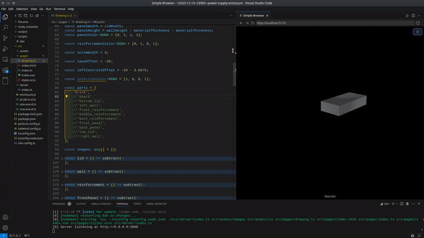

# Create JSCAD Project

## Introduction

An NPX starter template designed to kickstart your JSCAD projects using TypeScript and Hot Reload preview. This tool simplifies the process of setting up a JSCAD project, allowing you to focus on creating fully parametric CAD drawings with ease.



## Features

- 🚀 **Easy Setup**: Initialize your JSCAD project with a single command.
- 💻 **TypeScript Support**: Leverage the power of TypeScript for more robust code.
- 🔁 **Hot Reload Preview**: Instantly view changes in your CAD design as you code.
- 🔧 **Automatic Interactive Controls**: If you define parameters in your design, the viewport will render interactive controls that can be changed in the UI.
- 📁 **Automated Structure and Dependency Management**: Automatically creates the necessary folder structure and installs dependencies.
- 🎨 **Focus on Design**: Spend more time designing and less on setup.
- 🛠️ **Integrated VSCode Experience**: Recommended extensions and launch configurations for a seamless development experience.
- 📤 **Advanced Export Options**: Export your designs to X3D, 3MF, and SVG formats.

## Like this project? ❤

Please consider:

- [Buying me a coffee](https://ko-fi.com/jeanlescure) ☕
- Supporting me on [Patreon](https://www.patreon.com/jeanlescure) 🏆
- Starring this repo on [Github](https://github.com/simplyhexagonal/create-jscad-project) 🌟

## Getting Started

### Prerequisites

Ensure you have Node.js installed on your system to use `npm` or `npx`.

### Installation

To create a new JSCAD project, run the following command in your terminal:

```bash
npm init jscad-project <your-project-name>
```

or

```bash
npx create-jscad-project <your-project-name>
```

This command will create a new directory with your project name, set up the folder structure, and install all the necessary dependencies.

### Templates

To use a specific template, pass the `--template` argument when creating a new project. For example:

```bash
npm init jscad-project <your-project-name> -- --template=screw-and-nut
```

To list available templates you can run:

```bash
npx create-jscad-project --list-templates
```

There are currently two templates available:

- `default`: A blank canvas for whatever project you're working on.
- `screw-and-nut`: Contains a screw and nut for you to play with.

More templates will be added soon, hopefully by contributors too!

### VSCode Integration

- **Recommended Extensions**: The generated `.vscode` directory contains recommendations for helpful extensions. Please review and install them to enhance your development experience.
- **Launch Configuration**: Use the "Launch JSCAD" configuration in the `Run and Debug` section of VSCode. This will open the `drawing.ts` file, run `npm run dev`, and open the preview browser. 
  - **Note**: The first time you run this, the preview browser may initially display a white screen. Please wait until the debug output indicates that it's safe to reload the simple browser panel.

### Alternatively - Development in other IDEs

If you are **NOT** using VSCode, or if you'd rather run the dev environment manually, then, after setting up your project, navigate to your project directory and start the development server:

```bash
cd <your-project-name>
npm run dev
```

### Preview and Export

- In the preview window, you have the option to export your designs to X3D and 3MF file formats.
- To export to SVG, project any parts into 2D and ensure the "Projection" checkbox is turned on.

## Related Projects and Resources

`create-jscad-project` is built upon and inspired by the capabilities of JSCAD. Here are some resources and related projects that can enhance your experience with JSCAD:

- **JSCAD**: The core framework upon which this project is based. For more information and documentation, visit [JSCAD's Github](https://github.com/jscad/OpenJSCAD.org).

- **JSCAD Cheat Sheet**: A handy guide for quick reference to JSCAD syntax and features. Perfect for beginners and experienced users alike. Check out the [JSCAD Cheat Sheet](https://openjscad.xyz/dokuwiki/doku.php?id=en:jscad_design_guide).

- **Parametric Polysphericon Design Tutorial**: Dive into a practical example of parametric design with JSCAD in this informative YouTube video by CodeDoodle. Watch the [Parametric Polysphericon Design using JSCAD](https://www.youtube.com/watch?v=j0GNx376kcY) for insights and inspiration.


## Contributing

Contributions are welcome! Feel free to submit pull requests or open issues to improve `create-jscad-project`.

## Contributors

<table>
  <tr>
    <td align="center">
      <a href="https://github.com/jeanlescure">
        
      </a>
    </td>
    <td align="center">
      <a href="https://github.com/springbov">
        
      </a>
    </td>
  </tr>
</table>

## License

This project is licensed under the [Apache-2.0]([LICENSE](https://www.apache.org/licenses/LICENSE-2.0)).

Happy Designing with `create-jscad-project`!
